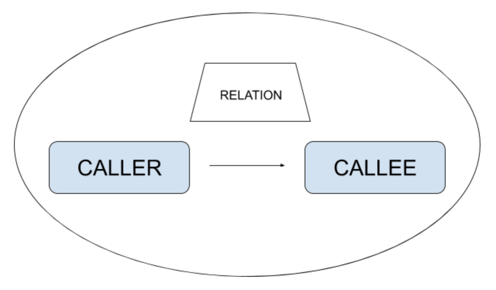

# [GETTING STARTED] Python Design Wizard docs

## Introduction 

### What I need to know before anything?

All the nodes of [Python AST](https://greentreesnakes.readthedocs.io/en/latest/nodes.html) are abstracted in *Python Design wizard* in form of `entity`.

Every `entity` has a set of [relations](https://greentreesnakes.readthedocs.io/en/latest/nodes.html). Here is how a relation works:



Every relation has a caller and a callee, beyond the type of relation.

Example 1:

```python
# Relation: CALLS
def function_xpto(): # Caller
    array.sort()     # Callee

# function_ xpto CALLS sort
```

Example 2:

```python
# Relation: HASLOOP
for element in array:  # Caller
    while True:        # Callee
        print(element)

# for HASLOOP while
```

Example 3:

```python
# Relation: HASFIELD
def function_xpto(): # Caller
    a = 3            # Callee

# function_ xpto HASFIELD assign
```

---

The entity abstraction appends a number to each new node parsed, the only exceptions are `classes` and `defined functions`, but they can also be accessed by the same [method](https://github.com/Caio-Batista/python-dw/tree/master/api#design_get_entity). Check the examples bellow:

Example 1:

`file_parsed.py`
```python
for e in 'abc':
    print(e)

for k in [1,2,3]:
    print(k)
```

`dw.entities`
```
{
    "for": [<for1>, <for2>],
    "print": [<print1>, <print2>]
}
```

Example 2:

`file_parsed.py`
```python
def function_xpto():
    array.sort()
    array2.sort()
```

`dw.entities`
```
{
    "def_function_xpto": <function_xpto>,
    "sort": [<sort1>, <sort2>]
}
```

---

## Step-by-step

### 1. Important files

`scripts.json`: should contain your test name.

`file.py`: the file to be parsed.

`test_xpto.py`: the test file that will run for your files.

All three files are configured here, just run:

```shell
$ python2 -m demo.demo_interact "" tests/data/example demo/scripts.json f

Directory: tests/data/example


. /file.py

```

### 2. Create new files

At the folder `tests/data/example` create other files to run your `test_xpto.py`.

### 3. Modify your test

Use the [API](https://github.com/Caio-Batista/python-dw/tree/master/api#api-python-design-wizard-docs) to change your test and also check the [test section](https://github.com/Caio-Batista/python-dw/tree/master/tests#test-python-design-wizard-docs) to improve `test_xpto.py`.
